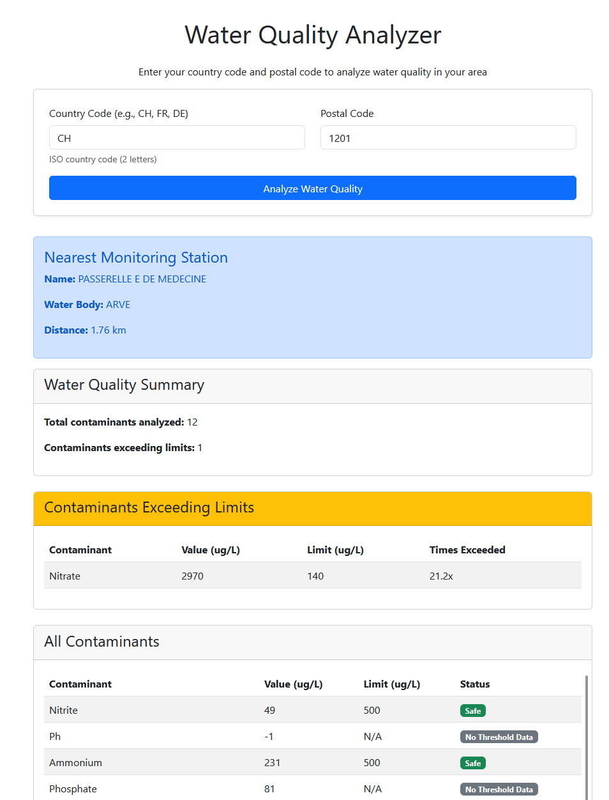
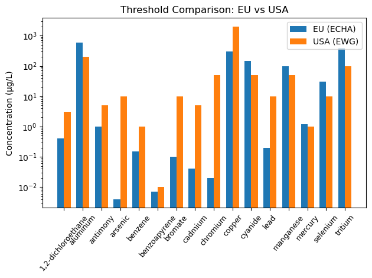

# European Water Quality Analyzer
## Overview

The European Water Quality Analyzer is a Python application and Flask web service that leverages the European Environment Agency's DiscoData SQL API to retrieve and analyze water quality data for any European country.

Given a country code and postal code, it identifies the nearest water monitoring station, retrieves its latest contaminant measurements, and evaluates whether they exceed health or regulatory thresholds. This empowers the user to better understand the state of local water, and the one they might be consuming daily.





## Datasets
The contaminants present in the European waters are taken from the [European Environment Agency (EEA)](https://www.eea.europa.eu/en/datahub/datahubitem-view/208518d1-ffe3-4981-9cae-13264cd9c32c). In each user resquest, the latest measurements are pulled in real time from the [SQL server](https://discodata.eea.europa.eu/) the EEA provides. 

The contaminant thresholds are taken from the [ECHA](https://echa.europa.eu/quality-criteria-water) (EU) and the [EWG](https://www.ewg.org/tapwater/all-ewg-standards.php) (US). The script ```scripts/create_thresholds_file.ipynb``` creates a csv file (```data/contaminant_thresholds.csv```) with the thresholds.

The extracted thresholds from the ECHA and EWG look as follows

We can see that the in most cases, the EU sets stricter thresholds for water contaminants compared to the US.


## Getting Started


1. Clone this repository:
   ```bash
   git clone https://github.com/sabateri/arxiv_wordFreq.git
   cd arxiv_wordFreq
   ```

2. Run the Docker container
    ```bash
    docker build -t water-quality-app .
    docker run -p 5000:5000 water-quality-app
    ```

3.  Open your browser and navigate to http://127.0.0.1:5000/ to interact with the visualizations.

## For Development
### Prerequisites
Make sure you have ```Python 3.11.11``` installed.

Follow steps 1. from the previous section  ```Getting Started```, then

3. Install the required libraries:
    ```bash
    pip install -r requirements.txt
    ```
4. Running the code  
    4.1
    To run the analysis locally, execute the following:
    ```
    python3 app.py
    ```
    4.2
    Open your browser and navigate to http://127.0.0.1:5000/ to interact with the visualizations.


## Todo
- Add health advice for each contaminant
- Check that I have all EU contaminants (take care fo nitrates, nitrites)
- Add a map?
- Cache results for a given country