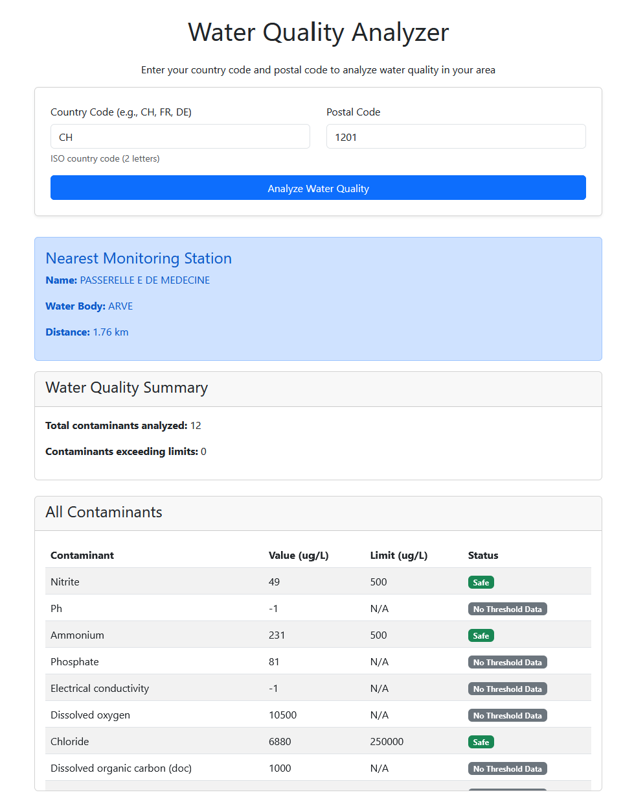

# European Water Quality Analyzer
## Overview

The European Water Quality Analyzer is a Python application and Flask web service that leverages the European Environment Agency's DiscoData SQL API to retrieve and analyze water quality data for any European country.

Given a country code and postal code, it identifies the nearest water monitoring station, retrieves its latest contaminant measurements, and evaluates whether they exceed health or regulatory thresholds. This empowers the user to better understand the state of local water.




### Prerequisites
Make sure you have ```Python 3.11.11``` installed.

1. Install the required libraries:
    ```bash
    pip install -r requirements.txt
    ```
2. Running the code  
    2.1
    To run the analysis locally, execute the following:
    ```
    python3 app.py
    ```
    2.2
    Open your browser and navigate to http://127.0.0.1:5000/ to interact with the visualizations.